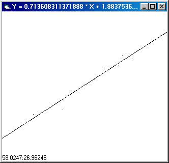



## Line of Best Fit Demo

### Description

The line of best fit is the line that best fits a set of data that is more or less linear. There are a number of ways to calculate this but I'll use the method of sum of least squares. In this method, we find a line where the sum of the square of the distances from the line to each point is minimized. While that sounds complicated to do, the execution is actually quite simple.

If you are interested in the derivation of the math, I found a website through GOOGLE that has the required formulas:

http://people.hofstra.edu/faculty/S...regression.html

For the line of best fit Y = M * X + B:

M = (n *Sxy - Sx * Sy) / (n * Sx2 - Sx * Sx)

B = (Sy - M * Sx) / n

Where:

n = number of points

Sx = the SUM of all the X coordinates

Sy = the SUM of all the Y coordinates

Sxy = the SUM of all (x * y)

Sx2 = the SUM of all (x * x)

So to calculate the line of best fit, set up a bunch of variables like above. Then, everytime you get a new datapoint, update the variables and calculate a line using the equations.

You can then check the coefficient of correlation using a formula found on the URL.

In the Demo program, you simply click on the form to place data points. The program will then draw a line of best fit based on those data points. Double click on the form to clear it and start anew.
 
### More Info
 
If your data is close to a vertical line, you may experience overflow or division by zero errors.

             |
---                |---
**Submitted On**   |2002-10-16 13:11:34
**By**             |[Bill Soo](https://github.com/Planet-Source-Code/PSCIndex/blob/master/ByAuthor/bill-soo.md)
**Level**          |Intermediate
**User Rating**    |5.0 (30 globes from 6 users)
**Compatibility**  |VB 3\.0, VB 4\.0 \(16\-bit\), VB 4\.0 \(32\-bit\), VB 5\.0, VB 6\.0
**Category**       |[Complete Applications](https://github.com/Planet-Source-Code/PSCIndex/blob/master/ByCategory/complete-applications__1-27.md)
**World**          |[Visual Basic](https://github.com/Planet-Source-Code/PSCIndex/blob/master/ByWorld/visual-basic.md)
**Archive File**   |[Line\_of\_Be14711310162002\.zip](https://github.com/Planet-Source-Code/bill-soo-line-of-best-fit-demo__1-39890/archive/master.zip)

